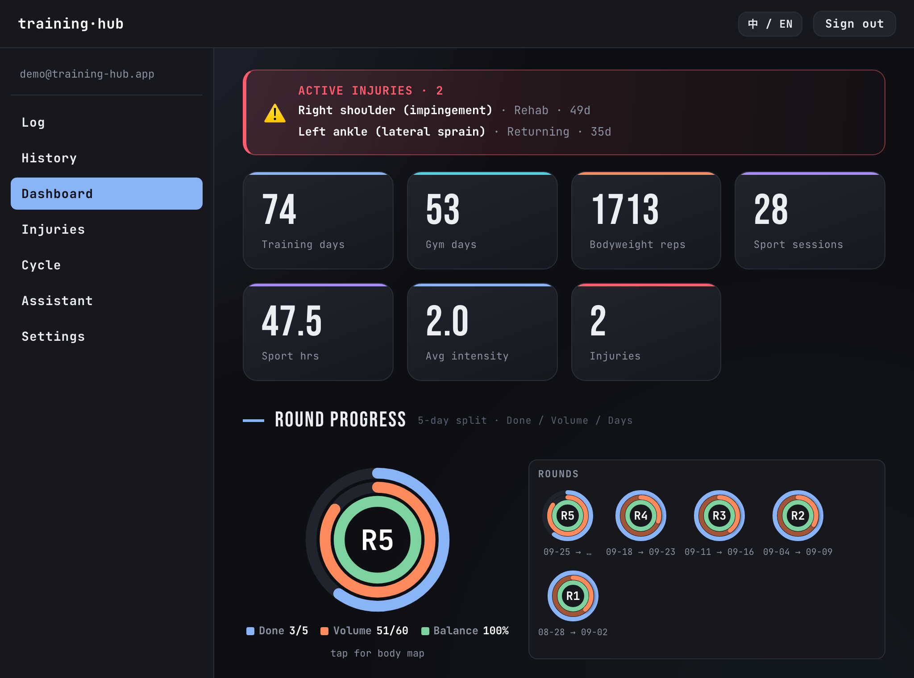
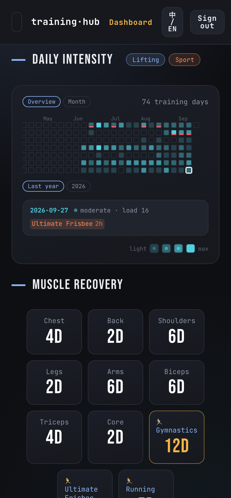
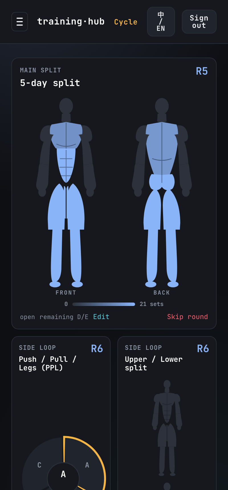
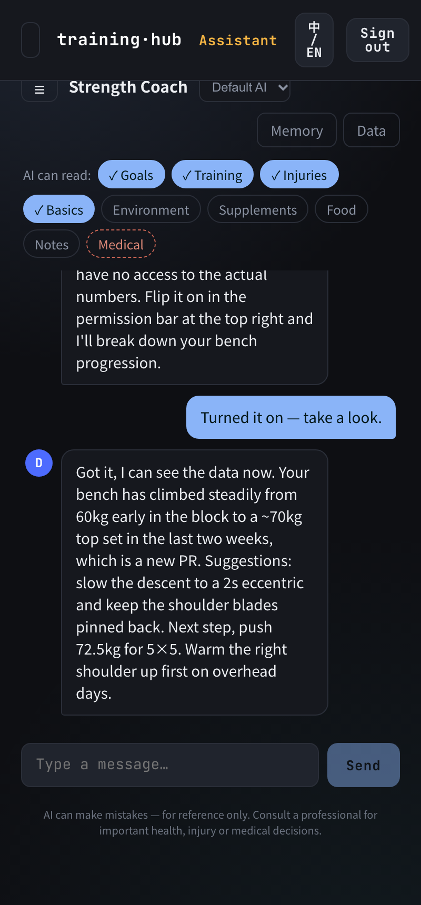
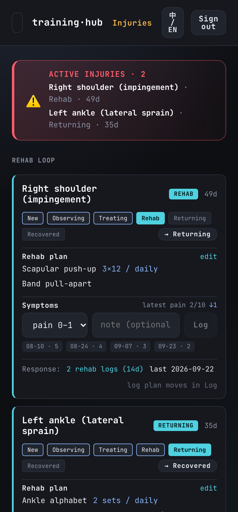
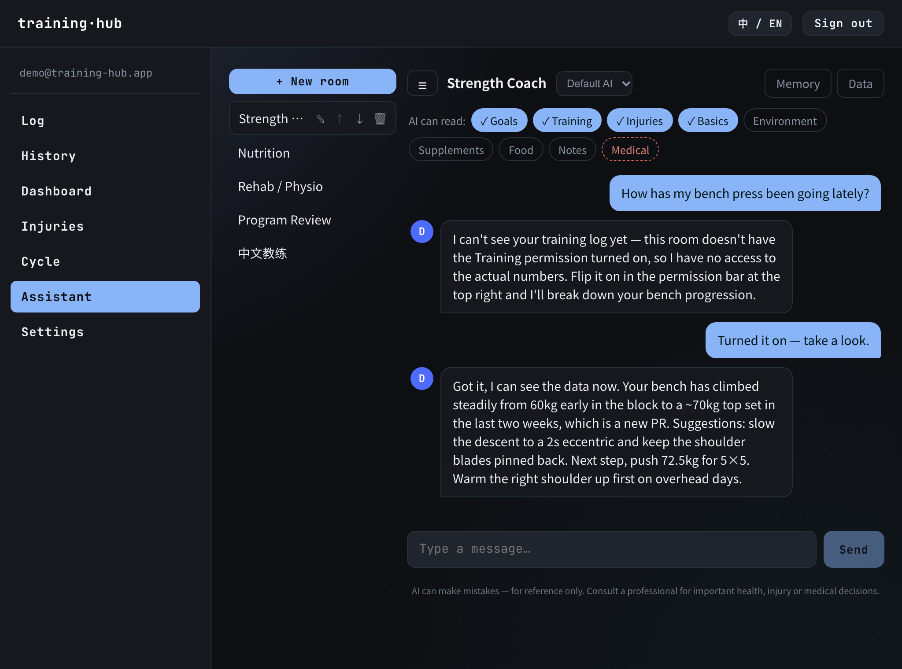
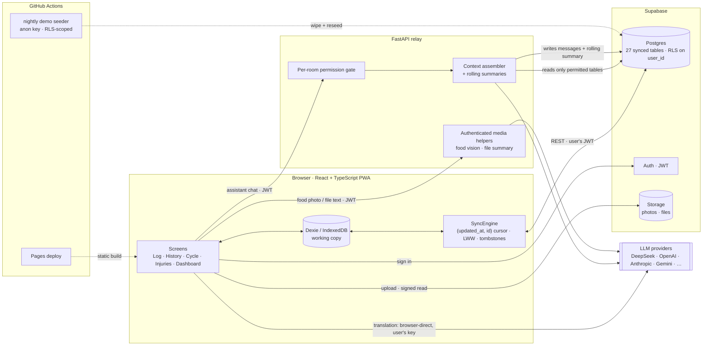

# training-hub

A bilingual (中 / EN) training and health app with an AI coach that can only read
what you let it. Per-set strength logging, progression analytics, injury and rehab
tracking, training cycles, and several AI chatrooms, each with its own model, memory,
and per-category data permissions enforced on the server.

React + TypeScript + Dexie in the browser, Supabase (Postgres / Auth / Storage / RLS)
as the source of truth, a small FastAPI relay for the LLM features. Bilingual down to
the data, not just the interface.

[](https://is-clarkhu.github.io/training-hub/)
[](https://github.com/is-ClarkHu/training-hub/actions/workflows/deploy.yml)
[](LICENSE)

<p align="center">
  
</p>

<p align="center"><strong>Desktop dashboard.</strong> Training totals, the open round, a year of daily load and muscle recovery in one view.</p>

<table align="center">
<tr>
<td width="25%"></td>
<td width="25%"></td>
<td width="25%"></td>
<td width="25%"></td>
</tr>
<tr>
<td><b>Dashboard.</b> A year of daily load in one grid, and how long each muscle group has gone untrained.</td>
<td><b>Cycle.</b> The open round lights the body model; finished splits keep running as side loops.</td>
<td><b>AI coach.</b> The chips are the room's read scope. The transcript shows one question before and after <code>Training</code> was granted.</td>
<td><b>Injuries.</b> An injury is an event with stages, a plan and a pain trend, not a line in a profile.</td>
</tr>
</table>

<p align="center"><sub>The same app installed on a phone.</sub></p>

<!-- Demo GIF: drop it in as the first image on the page, above the desktop shot.
     <p align="center"></p> -->

## Live demo

- **URL:** [https://is-clarkhu.github.io/training-hub/](https://is-clarkhu.github.io/training-hub/)
- **Email:** `demo@training-hub.app` · **Password:** `demo-training-hub`

A GitHub Actions job wipes and rebuilds the account every night, so it is never empty
and never stale: 15 weeks of coherent training (330 sessions, ~1,150 sets, with PRs and
previous-session comparisons), three training cycles, four injury recovery arcs at
different stages, body-measurement trends, a food log with AI nutrition estimates, and
five AI rooms with different permission matrices.

Edits get wiped by the next seed, so poke around. Live AI replies need your own LLM key
(Settings → AI), but the seeded transcripts, memories, summaries and permission
matrices are all readable without one. The seeder is in
[`frontend/scripts/seed-demo/`](frontend/scripts/seed-demo/README.md).

## Why it exists

I used to paste my workout into an AI chat after every session. That got old, so I
built somewhere to put it instead.

Then I got injured, and a text log turned out to be useless for tracking recovery, so
injuries became their own module. I still wanted to ask an AI about all of it, which
meant giving a model access to my training, my body metrics and eventually my medical
history. That is where permissions stopped being a checkbox and became the hardest part
of the project. Food and weight tracking came next, because a coach that can't see
what you eat can't say much. The cycle module came last: I train on a split, I miss
days, and every calendar-week planner I tried resets on Monday whether or not I actually
trained.

Every module here exists because the previous version of the app annoyed me.

About 19,000 lines of TypeScript and Python across 21 SQL migrations and more than
100 commits between June and September 2026.

## Design notes

The parts worth arguing about in a code review.

**Permissions are enforced where the data is read.** Each AI room has its own scope over
nine data categories. The relay never queries a table the room isn't allowed to see, so
unauthorized data can't reach the prompt even by mistake.

The one category that isn't a permission at all is the intimacy tracker: there is no
code path in the context assembler that reads it. Turning every switch on doesn't
expose it, because there is no switch.

<p align="center">
  
</p>
<p align="center"><sub>Five rooms, five permission matrices. The room on screen can read goals, training, injuries and basics; medical is opt-in and switched off.</sub></p>

**What one room can learn from another is a memory unit.** Old conversation compresses
into a rolling summary, and anything worth keeping gets promoted to a pinned memory
unit. A room can be granted read access to another room's shareable units without
inheriting its raw-data permissions or its chat history. The rehab room can know that
the bench goal is 100kg by year end without reading a line of the strength room's
conversation. Answers list which data they drew on.

**Why the sync cursor is a composite key.** Paging on `updated_at` alone silently drops
rows written in the same millisecond when they straddle a page boundary, so the cursor
is `(updated_at, id)`. Deletes travel as tombstones, conflicts resolve last-write-wins
on stable ids, and the clock is monotonic, so a system clock that jumps backwards can't
resurrect old rows.

Writes land in Dexie/IndexedDB first, so logging never waits on the network, and the
SyncEngine reconciles with Supabase on launch, reconnect, tab focus and a timer. It
tolerates a dead connection well, but I don't call it offline-first: sign-in,
cross-device sync and every AI feature need the network.

**Bilingual at the data layer.** Exercise names, sports and note tags are stored as
`_zh`/`_en` pairs. A lookup hits the local dictionary first; a miss triggers a
browser-direct model call whose result is written back, so each term is translated
once and then syncs across devices like any other row. Edit a translation by hand and
it locks; the model won't overwrite it. Offline, the source string shows through and
gets flagged for later.

**Rounds advance when you finish a session.** Miss a Wednesday and the round doesn't
reset. It still knows which day labels are done, what comes next, and how long each
muscle group has gone untrained. Workout entries link back to the cycle,
round and day they belong to, so the plan and what actually happened stay separable.

**Injuries are events.** Region, onset, pain score, symptoms, restrictions, photos and
recovery stage, appended as checkpoints over time, with rehab exercises assigned per
injury. That's the difference between "I hurt my shoulder once" and "I'm three weeks
into rehab and pain is down from 5 to 2".

**The demo seeds itself under RLS.** The nightly job signs in as the demo user with the
anon key, never `service_role`, so it is bound by exactly the same row-level security as
a visitor, and a leaked CI log gives away nothing but a public account.

## Architecture



| Module | Owns | The hard part |
| --- | --- | --- |
| `frontend/src/sync` | Reconciling the Dexie working copy with Supabase | Cursor boundaries at equal timestamps, delete propagation, clock skew |
| `backend/app/memory.py` | Assembling the AI context for one room | Deciding whether to *query* a table, not filtering after the fact |
| `frontend/src/translation` | Resolving bilingual data | Dictionary hit → model call → write back, with manual edits locked |
| `frontend/src/features/cycle` | Splits, rounds, body model | Advancing on completed sessions rather than the calendar |
| `frontend/src/db` | Dexie schema, records API, undo | Keeping ids stable so sync and undo agree |
| `frontend/scripts/seed-demo` | The public demo account | Generating 15 weeks of data that stays coherent, relative to today |

### What needs the relay

Only LLM calls that have to run server-side. Logging, History, Cycle, Injuries,
Dashboard, export, sync and the installable PWA all run on the static frontend plus
Supabase.

| Feature | Path | Needs relay? |
| --- | --- | --- |
| AI chat | `/api/assistant` | Yes. Reads your data and enforces the room's permissions server-side |
| Food photo → recognition + nutrition | `/api/describe-food` | Yes (vision) |
| Reference-file summary | `/api/summarize-file` | Yes |
| Translation dictionary | (none) | No. Browser-direct from Settings → AI; sends the term being translated and reads no Supabase account context |

`/api/translate` and `supabase/functions/translate` are legacy; translation moved
browser-direct and no longer calls them.

## Features

- **Log / History / Dashboard.** Per-set logging with warm-ups, supersets, dropsets,
  per-side and note tags; reverse-chron history; a daily-intensity calendar with a
  GitHub-style year overview, progression curves and body-part distributions.
- **Sports.** A user-editable sport library with custom per-sport fields, session
  logging and mini-charts.
- **Injuries.** Stage timeline, rehab library and plan, pain trend, photos, and rehab
  sessions that link back to the injury.
- **Cycle.** Split editor, rounds that advance on completed sessions, a body model
  shaded by the open round's volume, and per-muscle recovery spacing.
- **Bilingual data.** Not just labels: exercise and sport names live in both languages
  and follow the UI toggle.
- **Sync + installable PWA.** Supabase is the source of truth; the local cache keeps
  the UI instant.
- **AI assistant.** Several chatrooms, each with:
  - a permission matrix over nine data categories, enforced at read time;
  - rolling summaries, saved memory units, and opt-in cross-room memory sharing;
  - its own provider and model, picked from five graded tiers per provider that an
    "Update models" button re-points at whatever that provider serves today, read with
    your own key;
  - data modules with typed inputs and full add/edit/search: basics and measurement
    trends, food (photo recognition plus calorie and macro estimates), supplements,
    training environment, notes, medical background, and uploaded reference files;
  - sensitivity tiers: medical is opt-in per room, and the intimacy tracker is
    hard-isolated from the assistant entirely.

## Quick start

Bring your own Supabase project and your own LLM API keys. The backend passes keys
along with the active request and never logs or stores them. Full walkthrough,
including auth and the assistant backend, in **[SETUP.md](SETUP.md)**.

```bash
# 1. Supabase: create a project, apply every file in supabase/migrations/ in filename
#    order (dashboard SQL editor, or `supabase db push`), then create your login
#    account under Authentication → Users.

# 2. Frontend
cd frontend
cp .env.example .env.local     # fill VITE_SUPABASE_URL / VITE_SUPABASE_ANON_KEY
npm install && npm run dev     # http://localhost:5174

# 3. (optional) AI assistant backend
cd ../backend
python3 -m venv .venv && ./.venv/bin/pip install -r requirements.txt
cp .env.example .env           # fill SUPABASE_URL + SUPABASE_KEY (anon)
./.venv/bin/uvicorn app.main:app --port 8000
```

Log in, then add an LLM API key under Settings → AI to use the assistant. Point the
frontend at a deployed relay with `VITE_ASSISTANT_API_URL`; without it, the features
that need the backend are disabled off localhost and say so instead of failing.

## Deployment

- **Frontend** → any static host. `.github/workflows/deploy.yml` builds on push to
  `main`; set `BASE_PATH` for a project-path host plus the `VITE_*` secrets (Supabase
  URL and anon key, and `VITE_ASSISTANT_API_URL` for the relay).
- **Backend** → any container or PaaS. `render.yaml` is a Render blueprint; the free
  tier sleeps when idle and takes about a minute to wake, which the UI warns about. Set
  `SUPABASE_URL` / `SUPABASE_KEY` (anon) and `FRONTEND_ORIGIN` for CORS.

## Multi-user

Every table is row-level-security scoped to `user_id = auth.uid()`, so one Supabase
project can host many accounts with each user's data isolated, no schema change needed.
Accounts are invite-only by default (the owner creates them in Supabase Auth); flip
Supabase's sign-up setting for self-serve registration. One backend serves everyone,
scoping every read through the caller's JWT, and each user brings their own LLM keys.

## Limitations

Things a reader should know before judging it.

- Not offline-first. Writes land locally and the UI keeps working through a dropped
  connection, but sign-in, cross-device sync and every AI feature need the network.
- Conflict resolution is last-write-wins per row. Two devices editing the same set
  within the same sync window means the later write survives, with no merge UI.
- The relay is stateless and single-region. On Render's free tier it sleeps when idle
  and the first request after that takes about a minute, which the UI warns about.
- Answer quality is whatever model you point it at. The app controls what data reaches
  the prompt, not what the model does with it.
- One person's real usage is the only load this has seen. There are no benchmarks here
  because I have not run any that would mean anything at this scale.

## Structure

```
training-hub/
├── frontend/          React + Vite + TS PWA (see frontend/src/README.md)
│   └── scripts/       seed-demo: the nightly public-demo seeder
├── backend/           FastAPI relay: /api/assistant, /api/describe-food, /api/summarize-file
├── supabase/
│   ├── migrations/    SQL schema + RLS policies, source of truth (see its README)
│   └── functions/     translate: legacy Edge Function (translation is browser-direct now)
├── migration/         one-time legacy CSV → app importer (personal, optional)
├── assets/            README screenshots
├── render.yaml        Render blueprint for the backend relay
├── docs/              design docs, gitignored (private)
└── raw_data/          personal legacy data, read-only, gitignored
```

## Privacy

No credentials or API keys are committed. All `.env*` files, `docs/`, `raw_data/`,
`data/` and virtualenvs are gitignored. User-supplied API keys travel with the active
request and are never logged or persisted by the backend. The Supabase anon key is
browser-safe (`VITE_`-exposed) by design.

## License

[MIT](LICENSE).
